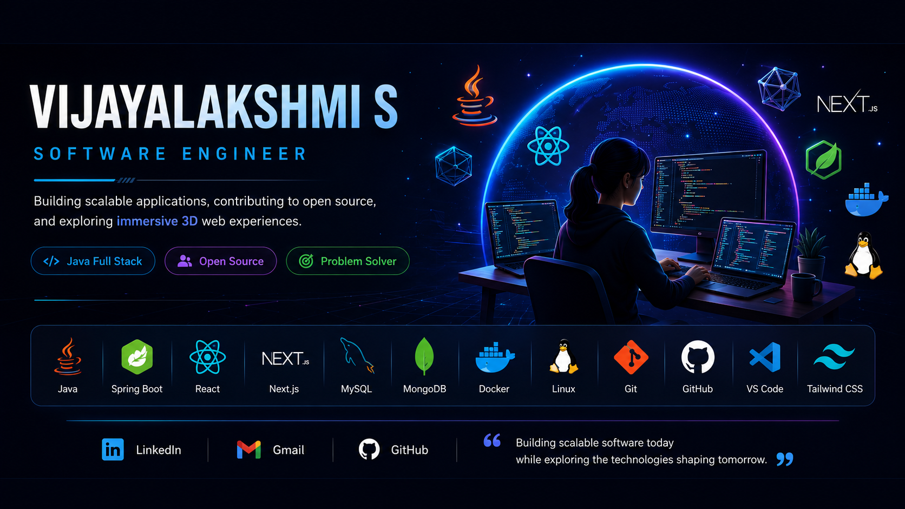

<p align="center">
  
</p>

<p align="center">
  
</p>

---

<h2 align="center">
  <span style="color:#2563EB;">ABOUT</span>
</h2>

```text
Software Developer passionate about building scalable,
high-performance applications using Java Full Stack technologies.

Currently contributing to Open Source while expanding into
interactive 3D web development with Next.js, Three.js,
React Three Fiber and Spline.
```

---

<h2 align="center">
  <span style="color:#2563EB;">TECH STACK</span>
</h2>

### Languages

<p align="center">

</p>

### Frontend

<p align="center">

</p>

### Backend

<p align="center">

</p>

### Database

<p align="center">

</p>

### DevOps & Tools

<p align="center">

</p>

### Currently Learning

<p align="center">


</p>

---

<h2 align="center">
  <span style="color:#2563EB;">CURRENT FOCUS</span>
</h2>

- Building scalable **Java Full Stack** applications
- Contributing to **Open Source**
- Learning **Docker** & **Linux**
- Exploring **Microservices**
- Building immersive websites using **Next.js**, **Three.js**, **React Three Fiber** and **Spline**
- Improving **Data Structures & System Design**

---

<h2 align="center">
  <span style="color:#2563EB;">FEATURED PROJECTS</span>
</h2>

### Retail Insight Hub

```text
Java • Spring Boot • React • MySQL

Retail analytics platform designed for inventory
management, sales reporting and business insights.
```

---

### Open Source

```text
Feature Development

Bug Fixes

Documentation

Community Collaboration
```

---
<h2 align="center">
  <span style="color:#2563EB;">INTERNSHIP EXPERIENCE</span>
</h2>


### Impact of Social Media Reels and Television Content on Human Brain Activity and Attention Using EEG Analysis
<h4>
<span>Role: <i> Brain Technlogies  Intern "|
</i>
Organization:<i>VTU with ITIE</i>|

Duration:<i>Feb 2026 – May 2026</i>
</span>
</h4>

Developed a Python-based EEG signal analysis pipeline to study the cognitive effects of social media, television, educational videos, and resting conditions. Implemented frequency band analysis, statistical testing, and data visualizations to evaluate attention, mental fatigue, and cognitive engagement.

**Tech Stack:** Python, NumPy, Pandas, Matplotlib, SciPy, Scikit-learn, Statsmodels, MNE

🔗 **Repository:** https://github.com/vijayalakshmis32/Impact-of-Social-Media-Reels-and-Tv-Content-on-Human-Brain-and-Attention-Using-EEG-Analysis-

---
<h2 align="center">
  <span style="color:#2563EB;">LET'S CONNECT</span>
</h2>

<p align="center">

<a href="https://github.com/vijayalakshmis32/vijayalakshmis32">

</a>


<a href="www.linkedin.com/in/vijayalakshmis01">

</a>


<a href="mailto:vijayalakshmi_s_@outlook.com">

</a>


<a href="1516477385208369317">

</a>

</p>

<p align="center">
<i>"Building software that is scalable, modern and designed to create meaningful experiences."</i>
</p>
